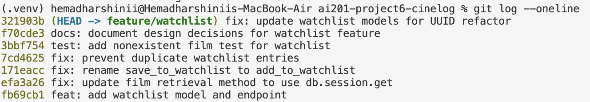

# **PR Response Doc — CineLog Watchlist Feature**

### **Screenshot of Commit History**



### **AI Usage**
<!-- Fill in at the end — how you used AI tools during this project -->
I used AI tools throughout this project as a support tool for understanding the codebase and validating my reasoning. For implementation work, I used AI to help compare my changes against existing project patterns, such as understanding how `add_to_collection()` handled duplicate entries before implementing the equivalent watchlist logic.

For Comments 4 and 5, I used AI as a devil's advocate after drafting my responses. I asked what counterarguments a careful reviewer might raise and what tradeoffs I might be missing. Based on that feedback, I strengthened my explanations by explicitly addressing privacy concerns for public watchlists and acknowledging the usefulness of alphabetical sorting while explaining why date-added better fits the typical watchlist workflow.

For the final commit review, I also used AI to check whether my commit messages followed conventional commit formatting and whether each commit represented a single logical change. I verified the suggestions myself against the project's contribution standards.

--- 

### **Comment 1 — Rename**
**What I did:** I renamed the service function `save_to_watchlist()` to `add_to_watchlist()` in `services/watchlist_service.py` so that it follows the project's existing verb-to-noun naming convention used throughout the codebase (for example, `add_to_collection()` and `remove_from_collection()`). I also updated every location where the function was referenced, including the import statement and function call in `routes/watchlist.py`.

**How I verified:** After completing the rename, I used a project-wide search for `save_to_watchlist` to confirm there were no remaining references anywhere in the repository. The search returned no results, confirming that all call sites had been updated. I then ran the full test suite using `pytest tests/ -v` to verify that the rename did not introduce any regressions or break existing functionality.

---

### **Comment 2 — Deduplication**
**What I did:** I added a duplicate check to `add_to_watchlist()` so that the service verifies whether the specified film is already on the user's watchlist before creating a new `WatchlistEntry`. If an existing entry is found for the same `user_id` and `film_id`, the function now raises an `AlreadyInWatchlistError` instead of creating a duplicate record. I also documented this behavior in the function's `Raises` section.

To keep the implementation consistent with the rest of the codebase, I followed the same pattern used in `add_to_collection()` within `services/collection_service.py`: validate that the film exists, check for an existing entry, raise a custom exception if a duplicate is detected, and only create and commit a new entry when no duplicate exists.

**How I verified:** I compared my implementation against the existing `add_to_collection()` function to ensure it followed the same validation and deduplication workflow. After making the change, I ran the full test suite using `pytest tests/ -v` to confirm that the modification did not introduce any regressions.

---

### **Comment 3 — Missing test**
**What I did:** I created a new test file, `tests/test_watchlist.py`, and added a test named `test_add_to_watchlist_nonexistent_film_raises()`. This test verifies that attempting to add a film whose `film_id` does not exist in the database raises `FilmNotFoundError` instead of resulting in a database integrity error or creating an invalid watchlist entry.

To keep the testing style consistent with the rest of the project, I modeled the test directly after `test_add_to_collection_nonexistent_film_raises()` in `tests/test_collection.py`. I used the same fixture structure, application context, and assertion pattern, changing only the service function being tested.

**How I verified:** I first ran `pytest tests/test_watchlist.py -v` to confirm that the new test passed independently. I then ran the full test suite using `pytest tests/ -v` to verify that the new test integrated cleanly with the existing tests and did not introduce any regressions.

---

### **Comment 4 — Default visibility** 
**My position:** I support keeping the default value of `public=True` for watchlists.

**Reasoning:** CineLog is a social platform centered around discovering and discussing films. A public watchlist allows users to share upcoming movies they are interested in, helps other users discover new films through recommendations, and makes user profiles more engaging without requiring additional configuration. Most users who choose to create a watchlist are doing so to organize films they plan to watch, and making those lists visible by default encourages discovery and community interaction while still allowing future privacy features to build on that foundation.

**Tradeoff acknowledged:** The primary advantage of a private-by-default watchlist is that it prioritizes user privacy and avoids exposing viewing interests unless a user explicitly chooses to share them. That approach reduces the possibility of unintentionally revealing personal preferences. However, for CineLog's emphasis on film discovery and social engagement, I believe a public default provides greater value for the majority of users. If stronger privacy controls become a priority in the future, allowing users to change the visibility after creating the watchlist would preserve that flexibility without sacrificing discoverability by default.

---

### **Comment 5 — Sort order**
**My position:** I agree with changing the default watchlist order to sort by date added (newest first).

**Reasoning:** A watchlist primarily represents a user's future viewing queue rather than a permanent catalog. In most cases, users interact with the films they have added most recently, whether they are reviewing recent recommendations or deciding what to watch next. Displaying the newest additions first makes those recently saved films immediately visible and reduces the need to search through older entries.

**Engagement with reviewer's point:** I agree with the reviewer's observation that most users expect to see what they added recently. While alphabetical ordering makes it slightly easier to locate a specific title in a very large watchlist, watchlists are generally revisited based on when films were discovered rather than by title. If CineLog later supports user-selectable sorting, alphabetical order could become an optional view, but I believe date-added is the better default because it aligns with the most common workflow for managing a watchlist.

---

### **Comment 6 — Rebase**
**What conflicted:** I rebased `feature/watchlist` onto the updated `main` branch after the film ID refactor. The main branch changed film identifiers from integer IDs to UUID strings, which conflicted with watchlist code that still assumed integer-based film IDs.

**How I resolved it:** I updated the watchlist implementation to match the UUID-based model structure from `main`. Specifically, I changed the watchlist film references to use UUID-compatible string fields (`db.String(36)`) and updated related lookups to work with the refactored Film model.

**How I verified no conflict remains:** I completed the rebase successfully, ran `pytest tests/ -v` to confirm the updated code worked with the UUID models, and checked `git log --oneline` to verify the branch history was linear with no merge commits.

---

### **Stretch Features**

#### **Add `remove_from_watchlist()`**

I implemented a `remove_from_watchlist()` service that allows a user to remove a saved film from their watchlist. The function searches for the watchlist entry using the provided `user_id` and `film_id`. If no matching entry exists, it raises a `NotInWatchlistError`; otherwise, it deletes the entry from the database, commits the transaction, and returns `True`.

To keep the implementation consistent with the rest of the project, I followed the same structure and error-handling pattern used by `remove_from_collection()` in `services/collection_service.py`.

I also wrote a test that creates a watchlist entry, removes it using `remove_from_watchlist()`, and verifies that the operation succeeds. I chose this edge case because removing an existing watchlist item is the primary behavior of the new feature and confirms that entries are deleted correctly.

#### **Second Test**

Beyond the required nonexistent-film test, I added a second test for `remove_from_watchlist()`. This test verifies that an existing watchlist entry can be removed successfully and confirms that the function returns `True` after deleting the entry. I chose this case because it exercises the primary behavior of the new removal feature while following the same testing style used elsewhere in the project.

---

### **PR Description**
<!-- Written at the end — feature overview, design decisions, manual testing steps -->
#### **Overview**

This PR adds a watchlist feature to CineLog that allows users to save films they want to watch later. Users can add films to their watchlist, retrieve their saved films, and prevent duplicate watchlist entries through validation in the service layer.

#### **Design Decisions**

**Default Visibility: Public**

Watchlists default to `public=True` because CineLog is designed around film discovery and social engagement. Public watchlists allow users to share their interests and help other users discover films. The tradeoff is reduced privacy compared to a private-by-default approach, but public visibility better supports the platform's community goals.

**Sort Order: Date Added (Newest First)**

Watchlists are sorted by date added with the newest additions appearing first. This matches how users typically interact with watchlists: reviewing recently discovered films and deciding what to watch next. Alphabetical sorting may help users find titles in very large lists, but date-added better matches the primary workflow.

#### **Manual Testing Instructions**

1. Activate the virtual environment: `source .venv/bin/activate`
2. Run the test suite: `pytest tests/ -v`

3. Confirm the watchlist tests pass:
- Adding a nonexistent film raises `FilmNotFoundError`.
- Existing collection behavior remains unchanged.

4. Manually test the endpoint:
- Start the Flask application.
- Send a POST request to:
  ```
  /watchlist/<user_id>/add
  ```
- Include:
  ```json
  {
    "film_id": "<film_uuid>"
  }
  ```
- Confirm the film is added successfully.
- Attempt to add the same film again and confirm duplicate detection prevents another entry.

5. Retrieve the user's watchlist using: `GET /watchlist/<user_id>`\
Confirm entries are returned newest-first and include visibility metadata.

Expected result:
- The first POST creates a watchlist entry.
- The second POST with the same film returns the duplicate-entry error.
- GET returns the saved films ordered newest-first.